# Fumarole Plugin

**Embed a fully interactive terminal inside your Obsidian workspace.**  

 

---

## ✨ Features

- **True PTY terminal** — full color, TUI support, and interactive programs work out of the box.
- **Custom Icon** — distinct and unique icon to separate it from the native command palette.
- **Cross-platform** — auto-detects your OS and offers the right shells (PowerShell, cmd, zsh, bash, fish, custom).
- **Configurable pane layout** — open as a horizontal split, vertical split, or in the right sidebar.
- **Settings menu** — choose your default shell, font size, and split direction from the plugin settings.
- **Secure** — the WebSocket PTY server binds to `127.0.0.1` only; no external network access.

---

## 🚀 Installation

### Prerequisites

- **[Node.js](https://nodejs.org/)** (v18+) must be installed and available on your system PATH.
- A C++ compiler toolchain is required to build `node-pty`:
  - **Windows**: Install [Visual Studio Build Tools](https://visualstudio.microsoft.com/visual-cpp-build-tools/) (select "Desktop development with C++").
  - **macOS**: Install Xcode Command Line Tools (`xcode-select --install`).
  - **Linux**: `sudo apt install build-essential` (or equivalent).

### Option A — Install via BRAT (Recommended)

[BRAT](https://github.com/TfTHacker/obsidian42-brat) lets you install plugins directly from GitHub without waiting for community plugin approval.

1. Install the **BRAT** plugin from Obsidian's Community Plugins.
2. Open **Settings → BRAT → Add Beta Plugin**.
3. Paste this repo URL:
   ```
   doc-parihar/fumarole
   ```
4. Click **Add Plugin** — BRAT will clone and install it automatically.
5. Navigate to the plugin folder and run:
   ```bash
   cd <your-vault>/.obsidian/plugins/fumarole/
   npm install
   npm run build
   ```
6. Reload Obsidian, then enable **Fumarole** in **Settings → Community Plugins**.

> **Note:** The `npm install` and `npm run build` step is required because Fumarole uses `node-pty`, a native module that must be compiled on your machine.

### Option B — Manual Installation

1. Download the [latest release](../../releases/latest) (or clone this repo).
2. Copy the plugin folder into your vault:
   ```
   <your-vault>/.obsidian/plugins/fumarole/
   ```
3. Open a terminal in the plugin folder and run:
   ```bash
   npm install
   npm run build
   ```
4. In Obsidian, go to **Settings → Community Plugins → Installed Plugins**, and enable **Fumarole**.
5. Click the terminal icon on the left ribbon or use the Command Palette → **Open Fumarole Shell**.


---

## ⚙ Settings

| Setting | Description |
|---|---|
| **Default Shell** | Select from platform-appropriate options, or enter a custom shell path. |
| **Pane Split Direction** | Choose how the terminal opens: Horizontal (bottom), Vertical (side), or Right sidebar. |
| **Font Size** | Adjust the terminal font size (10–24px). |

---

## 🏗 Architecture

This plugin uses a **WebSocket bridge** to work around Electron's restrictions on native Node.js modules natively inside Obsidian.

1. The Obsidian plugin spawns a lightweight **background Node.js process** (`pty-server.js`).
2. This server uses [`node-pty`](https://github.com/nicknisi/node-pty) to create a true pseudoterminal attached to your native OS.
3. The plugin connects to the server via a local WebSocket to relay I/O keystrokes and ANSI color streams between [`xterm.js`](https://xtermjs.org/) and the PTY.

```mermaid
flowchart LR
    subgraph Obsidian["Obsidian Workspace"]
        direction TB
        Plugin["Fumarole Plugin\n(TypeScript)"]
        Terminal["xterm.js View\n(Canvas renderer)"]
        
        Plugin ===|Instantiates| Terminal
    end

    subgraph Server["Local PTY Server (Node.js)"]
        direction TB
        WS["WebSocket\n(ws://127.0.0.1)"]
        NodePTY["node-pty\n(Terminal Emulator)"]
        
        WS ===|Relays internal IPC| NodePTY
    end

    subgraph OS["Native OS Environment"]
        Process["Native Shell\n(pwsh, bash, zsh)"]
        Gemini["Interactive CLI\n(Gemini, vim, top)"]
        
        Process -.->|Runs| Gemini
    end

    Terminal <===|Keystrokes / Resize| WS
    WS <===|ANSI output stream| Terminal
    NodePTY <===|STDIN / STDOUT| Process
```



This ensures that interactive TUI programs (like the Gemini CLI or Vim) render perfectly with full color and format support, exactly as they do in your freestanding terminal.

---

## 🛠 Development

```bash
# Clone the repo into your vault's plugins folder
cd <your-vault>/.obsidian/plugins/
git clone https://github.com/doc-parihar/fumarole.git
cd fumarole

# Install dependencies
npm install

# Build (one-time)
npm run build

# Watch mode (auto-rebuild on changes)
npm run dev
```

---

## 📄 License

[MIT](LICENSE)
